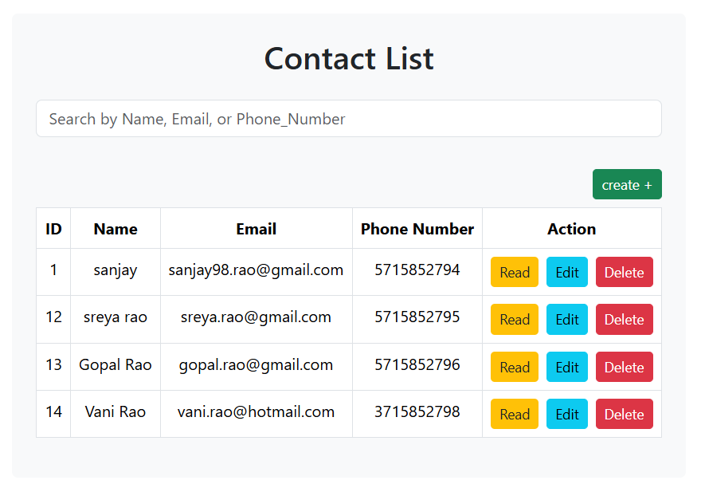
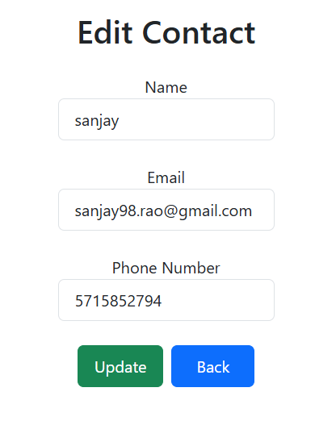
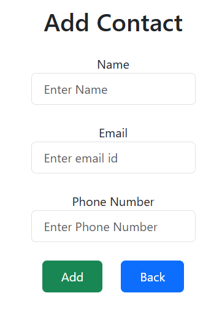
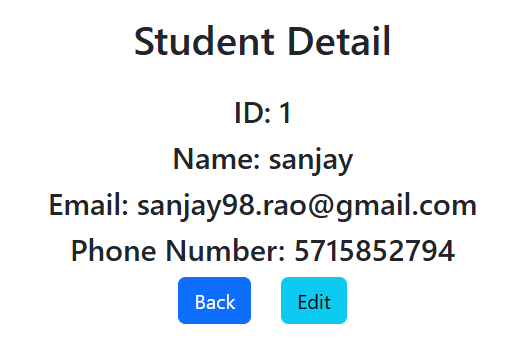

# ContactManager

A full-stack contact management system that allows users to create, read, update, delete (CRUD), and search for contacts. The project is built using React.js for the frontend, Node.js with Express for the backend, and MySQL as the database.

---

## Setup and Run Instructions

### **1. Backend Setup**
1. **Install Node.js Dependencies**:
   - Navigate to the backend directory (if separated).
   - Run the following command to install dependencies:
     ```bash
     npm install
     ```

2. **Set up MySQL Database**:
   - Create a MySQL database named `crud`.
   - Create a `contacts` table with the following schema:
     ```sql
     CREATE TABLE contacts (
       ID INT AUTO_INCREMENT PRIMARY KEY,
       Name VARCHAR(255),
       Email VARCHAR(255),
       Phone_No VARCHAR(10)
     );
     ```

3. **Run the Backend Server**:
   - Start the server by running:
     ```bash
     npm start
     ```
   - The backend will listen on `http://localhost:8081`.

---

### **2. Frontend Setup**
1. **Install React.js Dependencies**:
   - Navigate to the frontend directory.
   - Install dependencies using:
     ```bash
     npm install
     ```

2. **Run the Frontend Application**:
   - Start the frontend by running:
     ```bash
     npm start
     ```
   - The application will be available at `http://localhost:3000`.

---

## Features

1. **Create**: Add new contacts with name, email, and phone number.
2. **Read**: View a list of all contacts or details of a specific contact.
3. **Update**: Edit existing contact details.
4. **Delete**: Remove a contact from the database.
5. **Search**: Search for contacts by name, email, or phone number.

---

## Code Overview

### **Frontend**
1. **`Create.jsx`**:
   - Form for adding a new contact.
   - Includes validation for Email ID
   - Includes validation for a 10-digit phone number.

2. **`Home.jsx`**:
   - Displays the list of contacts in a table.
   - Features a search bar and delete functionality.

3. **`Read.jsx`**:
   - Displays detailed information about a single contact.

4. **`Update.jsx`**:
   - Form for updating contact details.
   - Includes validation for a 10-digit phone number.


### **Backend**
1. **`server.js`**:
   - Express server handling API routes.
   - Routes:
     - `GET /`: Fetch all contacts.
     - `GET /read/:ID`: Fetch a contact by ID.
     - `POST /student`: Add a new contact.
     - `PUT /update/:ID`: Update a contact by ID.
     - `DELETE /delete/:ID`: Delete a contact by ID.

---

## Approach and Design Decisions

1. **Frontend Design**:
   - Used React for modular and reusable components.
   - State management via `useState` and React Router for navigation.

2. **Backend Design**:
   - Implemented a RESTful API with Express.js.
   - Used MySQL for structured data storage.

3. **Trade-offs**:
   - A single-page application for a seamless user experience, but the search and delete operations could have been implemented with pagination or server-side processing for scalability.
   - Validation for phone numbers is simple and does not handle international formats.


## Screenshots

- []
- []
- []
- []